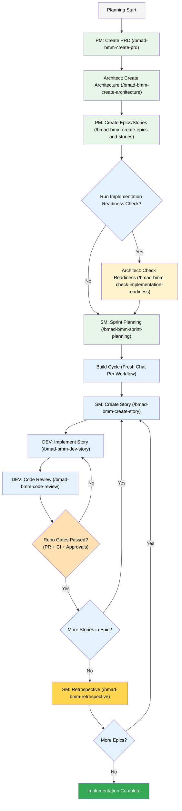

# 13. Scrum Workflow & Git Branching Strategy

> [!IMPORTANT]
> All development follows **Scrum methodology** with enforced Git branching rules. No code reaches `main` without passing through the full PR pipeline. This is non-negotiable — especially when AI agents are writing code.

### 13.1 Branching Model

Feature-branch workflow from `develop`:

```text
main (production)
  └── develop (integration)
        ├── feature/EPIC-STORY-short-description
        ├── bugfix/TICKET-short-description
        ├── hotfix/TICKET-short-description (branches from main)
        └── release/vX.Y.Z (cut from develop)
```

##### Branch Naming Convention

| Prefix | Source Branch | Merge Target | Example |
| -------- | ------------- | ------------- | --------- |
| `feature/` | `develop` | `develop` | `feature/E1-S3-whatsapp-session-timer` |
| `bugfix/` | `develop` | `develop` | `bugfix/NA-142-token-refresh-failure` |
| `hotfix/` | `main` | `main` + `develop` | `hotfix/NA-200-payment-webhook-crash` |
| `release/` | `develop` | `main` + `develop` | `release/v1.2.0` |

### 13.2 Pull Request Requirements (Enforced in CI)

Every PR **must** satisfy all of the following before merge:

1. **Code Review:** Minimum 1 approval (2 for `main`)
2. **All CI Checks Pass:**
   - Security scan (Semgrep + Dependabot + TruffleHog + Trivy)
   - Architecture lint (`go-arch-lint`)
   - Unit tests with race detection
   - Integration tests (PostgreSQL + Redis)
   - E2E tests (Playwright)
3. **Coverage Gate:** No net decrease in coverage; 80% minimum for new code
4. **Branch Up To Date:** Must be rebased on latest `develop`
5. **No Unresolved Conversations:** All review comments addressed

### 13.3 Merge Strategy

- **Feature → develop:** Squash merge (clean single-commit history)
- **Release → main:** Squash merge (keeps `main` linear) + annotated Git tag for release changelog
- **Hotfix → main:** Squash merge + follow-up PR to `develop` (forward-port fix)

### 13.4 Scrum Cadence

| Ceremony | Frequency | Duration | Purpose |
| ---------- | ----------- | ---------- | --------- |
| **Sprint Planning** | Every 2 weeks | 2 hours | Select stories, break into tasks |
| **Daily Standup** | Daily | 15 min | Blockers, progress, coordination |
| **Sprint Review** | End of sprint | 1 hour | Demo completed work |
| **Retrospective** | End of sprint or epic (BMAD V6) | 1 hour | Process improvement and workflow tuning |
| **Backlog Grooming** | Weekly | 1 hour | Refine upcoming stories |

### 13.5 Definition of Done (DoD)

A story is **Done** when ALL of the following are true:

- [ ] Code reviewed and approved (1+ approvals)
- [ ] All unit tests pass (90% coverage for domain, 80% for service)
- [ ] Integration tests pass (adapter layer)
- [ ] Architecture lint passes (`go-arch-lint check`)
- [ ] Security scan clean (Semgrep + Dependabot + TruffleHog + Trivy)
- [ ] No P0/P1 bugs
- [ ] API documentation updated (if applicable)
- [ ] PR squash-merged into `develop`
- [ ] Deployed to staging and smoke-tested

### 13.6 BMAD V6 Workflow (IDE Workflow)

> [!IMPORTANT]
> This document follows **BMAD V6** workflow conventions. Compared to V4, epics/stories are now created **after architecture**, and each BMAD workflow should run in a **fresh chat**.

> [!TIP]
> **V6 Improvement:** Story quality improves when `create-epics-and-stories` is run after architecture, because data model, API patterns, and technical constraints are already defined.

The following Mermaid diagram shows the BMAD V6 planning + delivery flow with MarketBoss repository gates:



#### BMAD V6 Role Responsibilities

| Role | Agent Persona | Key Actions |
| ------ | --------------- | ------------- |
| **PM** (Product Manager) | Requirements orchestrator | Owns PRD quality and creates epics/stories after architecture |
| **Architect** | System design authority | Owns architecture and implementation readiness validation |
| **SM** (Scrum Master) | Delivery coordinator | Runs sprint planning, creates story files, runs epic retrospective |
| **DEV** (Developer) | Implementation agent | Implements stories and runs workflow-level code review |
| **User + Maintainer** | Final gatekeepers | Approve business fit, review PR, and authorize merge |

#### Agent Session Setup (Fresh Chat)

| Role | Agent Load Command | Typical Use |
| ------ | -------------------- | ------------- |
| **PM** | `/bmad-agent-bmm-pm` | PRD creation, epics/story generation |
| **Architect** | `/bmad-agent-bmm-architect` | Architecture creation, implementation readiness check |
| **SM** | `/bmad-agent-bmm-sm` | Sprint planning, create-story, retrospective |
| **DEV** | Use your configured DEV agent alias in BMAD | `dev-story` and `code-review` workflows |

#### Planning and Initialization (V6 Order)

| Step | Agent | Workflow | Command | Purpose |
| ------ | ------- | ---------- | --------- | --------- |
| 1 | PM | `prd` | `/bmad-bmm-create-prd` | Create/refresh PRD |
| 2 | Architect | `create-architecture` | `/bmad-bmm-create-architecture` | Create architecture document |
| 3 | PM | `create-epics-and-stories` | `/bmad-bmm-create-epics-and-stories` | Create technically-informed epics/stories using PRD + architecture |
| 4 | Architect (recommended) | `check-implementation-readiness` | `/bmad-bmm-check-implementation-readiness` | Validate planning cohesion before coding |
| 5 | SM | `sprint-planning` | `/bmad-bmm-sprint-planning` | Initialize `sprint-status.yaml` for execution tracking |

#### Build Cycle (Per Story, Fresh Chat Each Workflow)

| Step | Agent | Workflow | Command | Purpose |
| ------ | ------- | ---------- | --------- | --------- |
| 1 | SM | `create-story` | `/bmad-bmm-create-story` | Create story file from epic |
| 2 | DEV | `dev-story` | `/bmad-bmm-dev-story` | Implement the story |
| 3 | DEV | `code-review` _(recommended)_ | `/bmad-bmm-code-review` | Workflow-level quality validation |

After completing all stories in an epic, run **SM `retrospective`** (`/bmad-bmm-retrospective`) before moving to the next epic.

#### Workflow Reference (Canonical Commands)

| Workflow | Command | Agent | Purpose |
| ---------- | --------- | ------- | --------- |
| `help` | `/bmad-help` | Any | Get guidance on what to do next |
| `prd` | `/bmad-bmm-create-prd` | PM | Create Product Requirements Document |
| `create-architecture` | `/bmad-bmm-create-architecture` | Architect | Create architecture document |
| `create-epics-and-stories` | `/bmad-bmm-create-epics-and-stories` | PM | Break down PRD into epics |
| `check-implementation-readiness` | `/bmad-bmm-check-implementation-readiness` | Architect | Validate planning cohesion |
| `sprint-planning` | `/bmad-bmm-sprint-planning` | SM | Initialize sprint tracking |
| `create-story` | `/bmad-bmm-create-story` | SM | Create a story file |
| `dev-story` | `/bmad-bmm-dev-story` | DEV | Implement a story |
| `code-review` | `/bmad-bmm-code-review` | DEV | Review implemented code |
| `retrospective` | `/bmad-bmm-retrospective` | SM | Close epic and capture process improvements |

#### MarketBoss Repository Gates (Retained, Non-Conflict)

- BMAD workflow completion does **not** bypass repository controls in sections `13.2` and `13.5`.
- A story is not Done until PR checks pass, required approvals exist, and merge is completed.
- Use BMAD `code-review` as workflow quality support, then enforce CI/security/coverage gates in GitHub.
- Respect branch protections and merge strategy defined in section `13.3`.

#### Agent Autonomy Modes (V6-Compatible)

| Mode | User Prompt Pattern | What Happens |
| ------ | --------------------- | -------------- |
| **Step-by-step** | User triggers each workflow command manually | Agent executes one workflow and waits |
| **Story-autonomous** | "Run one full story cycle" | Agent runs `create-story` → `dev-story` → `code-review` across fresh chats, then stops at repo merge gate |
| **Epic-autonomous** | "Run this epic end-to-end" | Agent repeats story cycles, then runs `retrospective`, and pauses before next epic |

**Cycle Boundary (Hard Rule):** Do not start the next story or epic without explicit user approval.

#### Cycle Position Check (Resumption Rule)

> [!WARNING]
> Before starting any BMAD workflow, check current execution state to avoid duplicating or skipping story work.

| Check | How | What To Look For |
| ------- | ----- | ------------------ |
| Sprint tracker | Read `docs/sprint-status.yaml` | Active epic/story, pending workflow step |
| Story files | Read `docs/stories/` | Stories in `ready-for-dev`, `in-progress`, `in-review` |
| Git status | `git status` + `git log -5` | Uncommitted work or partially completed implementation |
| PR status | `mcp__github__list_pull_requests` | Open PRs needing review or failing CI |
| Prior workflow notes | Read latest story dev notes | Last completed BMAD workflow and blockers |

##### Resumption behavior

- If a story is `in-progress`, continue from the next incomplete BMAD workflow.
- If CI is failing on an open PR, fix CI before starting new story work.
- If sprint tracker and story files disagree, reconcile tracker first.
- If state is unclear, ask the user before proceeding.

---

