# User Journey Flows

### Journey 1: DM Close (Defining Experience)

> **"See a customer message → send a perfect reply → close the sale"** — 3 taps, <10 seconds.

**Trigger:** Customer DMs on IG/WA → Smart notification with revenue context → Feed item appears in DRAFT_READY state.

**Entry:** Smart notification on lock screen — not "new message" but "Chioma asked about ankara (₦8,500)." Revenue potential visible. Single tap → Revenue Command Feed with item at top.

```mermaid
flowchart TD
    A["📱 Smart Notification\n'Chioma asked about ankara ₦8,500'\n[Reply Now]"] --> B["📋 Revenue Command Feed\nDM item: DRAFT_READY state"]
    B --> C{"Manual reply\ndetected?"}
    C -->|Yes| D["✓ MANUAL_REPLIED\n50% opacity · 'Replied via IG'\nAI option removed"]
    C -->|No| E["Tap: '✨ Reply with AI draft →'"]
    E --> F["Inline Expansion:\n💬 Customer msg quoted\n✨ AI Draft — Draft 1/3\n⭐⭐⭐⭐⭐ SLM rating"]
    F --> G["Tone Chips:\n[Friendly] [Pidgin] [Formal]"]
    G --> H{User Decision}
    H -->|"➤ Send"| I["SENDING → SENT\n✓ green badge · 80% opacity\n[Undo 3s]"]
    H -->|"✏️ Edit"| J["EDITING state\nInline text editing\n[Cancel] [Send]"]
    H -->|"🔄 New Draft"| K{"Draft ≤ 3?"}
    H -->|"✕ Dismiss"| L["Confirmation dialog\nDISMISSED · slides out"]
    K -->|Yes| F
    K -->|"No, 3 of 3"| M["Manual compose only\n'Draft limit reached'"]
    J --> I
    I --> N{"Buying intent\ndetected?"}
    N -->|Yes| O["💳 Payment link\nauto-attached\nPaystack or OPay"]
    N -->|No| P["COMPLETED\nCollapses after 30min"]
    O --> Q["🎉 Receipt\n'₦8,500 received from Chioma'\n[📦 Ship] [💬 Thank]"]
    Q --> P
```

**Key metrics:** 3 taps, <10 seconds, notification → money.

#### DM Close Edge Cases

| Edge Case | Solution |
| ----------- | ---------- |
| Empty catalog (product not found) | Draft: "Let me check and get back to you" + ⚠️ "Add product" prompt |
| Terrible AI draft (3 bad regenerations) | Auto-switch to manual compose with customer msg + PrimingCard context visible |
| Payment failure | "⚠️ Payment failed" feed item + auto-draft "No worries, try again" + 24h link expiry |
| WhatsApp API down | Banner: "⚠️ WhatsApp connection issue" · IG continues · retry indicator |
| Customer sends multiple messages | AI incorporates ALL messages in single draft · "3 messages" badge · full thread in PrimingCard |
| Seller opens draft but leaves app | State preserved — draft stays open on return, no timeout |
| Same customer on IG AND WA | Separate feed items (per-conversation) · PrimingCard shows "Also messaged on WhatsApp" |
| Manual reply during AI compose | Pre-send conflict check → "Already replied from IG. Discard draft?" dialog |
| Two DMs about same product, 1 in stock | First sale → second DM gets "⚠️ Stock updated" badge + regenerated draft with "just sold" messaging |

#### DM Close Micro-Timing Breakdown

| Step | Target | Realistic | Fix |
| ------ | :------: | :---------: | ----- |
| Notification → app open | 1s | 2-4s | Service worker pre-cache · PWA instant load |
| Find DM in feed | 0s | 0s | Already at top (chronological) |
| Tap "Reply with AI draft" | 0.3s | 0.3s | CSS transform only |
| Inline expansion render | 0.3s | 0.5-1s | Pre-generate draft ON DM ARRIVAL, not on tap |
| Read context + draft | 2-3s | 2-3s | Human reading speed — by design |
| Tap Send | 0.3s | 0.3s | Optimistic UI (show SENT immediately) |
| Confirmation | 0.5s | 1-3s | Optimistic UI masks API roundtrip |
| **TOTAL** | **4.5s** | **5-8s** | **Under 10s promise holds ✅** |

---

### Journey 2: Content Creation & Publishing

**Trigger:** AI auto-generates drafts based on catalog + Brand Voice → CONTENT feed item appears in feed.

```mermaid
flowchart TD
    A["🤖 AI generates drafts\nbased on catalog\nplus Brand Voice"] --> B["📋 Feed: CONTENT item\n'AI drafted 3 new posts'\n[📝 Review drafts →]"]
    B --> C["Draft Review\nSwipe between drafts\n⭐ SLM rating on each"]
    C --> D{User Decision}
    D -->|"✅ Post Now"| E["Platform selection\n[IG] [WA Status] [Both]\nOptimal time suggested"]
    D -->|"✏️ Edit"| F["Inline caption editor\nPhoto preview plus text\n[Cancel] [Save and Post]"]
    D -->|"🕐 Schedule"| G["Time picker\nAI suggests 6:45 PM\n[Confirm Schedule]"]
    D -->|"✕ Skip"| H["Next draft in stack\nor dismiss all"]
    E --> I["Published ✅ toast\n'Posted to IG · 6:45 PM'\nFeed item → SENT state"]
    F --> E
    G --> J["Scheduled ✅\n'Will post at 6:45 PM'\n⏳ pending badge"]
    I --> K["📊 Growth Assist\nfeedback after 1hr:\n47 likes · 3 DM inquiries"]
```

**Key metrics:** Review → publish in <5 seconds. Batch-approve multiple drafts via horizontal swipe.

#### Content Edge Cases

| Edge Case | Solution |
| ----------- | ---------- |
| No product photos in catalog | CONTENT item says "📸 Add a product photo to create posts" → camera opens directly |
| AI draft flagged as inappropriate | "⚠️ Flagged for review" + reason · auto-regenerates · persistent issues → manual editing |
| Post fails to publish (API error/auth expired) | "❌ Failed to publish" with [Retry] [Save as Draft] · auth expired → reconnect prompt |

---

### Journey 3: First-Time Onboarding

**Trigger:** New signup from referral/ad → activation in <5 minutes, 3-step progressive flow.

```mermaid
flowchart TD
    A["📱 Sign Up\nPhone number plus OTP"] --> B["👋 Welcome\n'Welcome, Boss! 3 steps\nto set up your business'"]
    B --> C["Step 1: Connect Platform\n[📸 Instagram] [💬 WhatsApp]\ntap to OAuth"]
    C --> D{"WA API\nverification?"}
    D -->|"Instant IG"| E["✅ Instagram connected\n'Found 3,200 followers'"]
    D -->|"Pending WA"| F["⏳ WA verification 2-6 weeks\nIG set as primary meanwhile"]
    E --> G["Step 2: Brand Voice\nPaste 5 of your best captions\nOR 🎤 Record voice"]
    F --> G
    G --> H["AI analyzes style:\nWarm, emoji-friendly,\nmixes English plus Pidgin\n[Thats me! ✅] [Adjust]"]
    H --> I["Step 3: Quick Catalog\n📸 Camera snap product\n🎤 Hold: 'Ankara, ₦8,500'\nAI parses and categorizes"]
    I --> J["✨ First AI Draft Generated\nWOW moment\n⭐⭐⭐⭐⭐ Sounds Like Me"]
    J --> K["🎉 'You are live, Boss!'\n→ Revenue Command Feed\nFirst content item ready"]
```

**Key metrics:** Sign-up → first "wow" moment in <5 minutes. 3-step progressive onboarding.

#### Onboarding Edge Cases

| Edge Case | Solution |
| ----------- | ---------- |
| User has 0 followers | Skip "Found X followers" · "Let's build from here" messaging |
| Pastes fewer than 5 captions | Show progress indicator ("3/5 captions submitted — paste 2 more to unlock AI post generation") · User stays in onboarding, never dropped · AI post generation blocked until 5 captions submitted |
| OAuth fails | Retry with clear error → "Skip for now" option → manual setup later · never blocks onboarding |

#### Business Profile Setup

During onboarding (after platform connection, before first post), users complete a **Business Profile Form** that feeds the AI knowledge base:

##### Business-Level Fields (one-time setup)

- Business name, tagline, description
- Product categories (selectable from taxonomy + custom)
- Pricing ranges (budget / mid-range / premium)
- Shipping policy: delivery areas, estimated timelines, costs, free shipping threshold
- Return & refund policy: window (days), conditions, who pays return shipping
- Accepted payment methods (bank transfer, Paystack, Flutterwave, cash on delivery)
- Operating hours & response time expectations
- Physical location (if applicable), contact channels
- Common FAQs (structured Q&A pairs)

##### Per-Product Quick Form (when creating a post)

- Product name, price, key features (3–5 bullet points), availability status
- Designed to be minimal (< 60 seconds to complete) to avoid frustrating users

##### Smart behaviors

- AI pre-fills fields from connected social platforms (Instagram product tags, WhatsApp catalog) where possible
- Advisory gap indicator: "Your profile answers 12/18 common buyer questions — add shipping info to improve AI responses"
- Non-blocking: user can proceed without completing, but AI response quality improves with more data
- All data feeds into RAG pipeline for AI-powered DM responses and content generation

#### Post-Onboarding (No Blank State)

Revenue Command Feed pre-populated on first visit:

- "📝 Your first AI draft is ready!" [Review →]
- "💬 Connect WhatsApp to unlock DM features" (if WA skipped)
- "📸 Add more products to your catalog" with [Camera] button
- Growth Assist: "Tip: Post your first content today for maximum reach"

---

### Journey 4: Morning Triage (Daily Command Center)

**Trigger:** Seller opens app each morning → revenue-first, action-oriented loop.

**Key metrics:** Full morning triage in <2 minutes. Zero navigation away from feed.

#### Morning Triage Edge Cases

| Edge Case | Solution |
| ----------- | ---------- |
| Zero feed items overnight | "All caught up, Boss! 🎉" + Growth Assist: "Post today to stay visible" + streak status |
| 100+ backlog items | Priority grouping: "🔥 5 hot leads (₦42K potential)" at top + batch actions: "Reply to all 5 DMs" |

---

### Cross-Journey Conflict Resolution

**Design principle: Non-blocking multi-tasking** — notifications INFORM but don't INTERRUPT. Current journey state is PRESERVED when switching. Return-to-context is always one tap away.

| Conflict | Scenario | Resolution |
| ---------- | ---------- | ------------ |
| DM interrupted by new DM | Editing Chioma's draft, Tunde DMs | Subtle dot on Feed tab · new item below current · no modal/popup |
| Mid-onboarding payment | At Brand Voice step, payment arrives | Toast: "🎉 ₦8,500 received" (5s auto-dismiss) · onboarding NOT interrupted |
| Content review + hot DM | Reviewing drafts, urgent DM arrives | Badge on Feed tab · content state PRESERVED · return after DM |
| Two DMs, same product, 1 stock | Chioma + Tunde both want ankara | First sale → second DM gets "⚠️ Stock updated" + regenerated draft |
| Manual reply during compose | Composing in MarketBoss, co-worker replies via IG | Pre-send conflict check → "Already replied from IG. Discard?" dialog |

### Navigation Dead-End Prevention

**Rule:** Never end on a blank screen — always suggest the next action.

| Journey End | What Follows |
| ------------ | -------------- |
| DM Close → COMPLETED | Revenue hero animates +₦ · feed scrolls to next DM · if none: "All caught up!" + suggest content review |
| Content Published | Swipe to next draft · if all done: "📊 Check performance in 1hr" |
| Onboarding Complete | Feed pre-loaded with first AI draft + "add more products" + Growth Assist tip |
| Draft Dismissed | Feed auto-scrolls to next item · NOT recoverable (prevents stale drafts) |
| Order Shipped | Auto-generates "Thank customer" draft with tracking link |
| Payment Failed | [Resend Link] + [Follow Up] AI draft · 24h expiry → "❌ Expired" label |

**Universal escape hatch:** Command bar accessible from any state — search, `/stats`, `/post`, `/help`.

---

### Journey Patterns

Reusable patterns extracted across all 4 journeys:

#### Journey Navigation Patterns

| Pattern | Description | Used In |
| --------- | ------------- | --------- |
| Result-first entry | App opens to most urgent action, never blank state | All journeys |
| Inline expansion | Actions expand within feed cards, no screen navigation | DM Close, Content |
| Progressive disclosure | Hero → expandable stats → detailed analytics page (post-MVP/Growth) | Morning Triage |
| Contextual actions | Different buttons per feed item type (DM/SALE/CONTENT/FOLLOW-UP) | All feed interactions |

#### Decision Patterns

| Pattern | Description | Used In |
| --------- | ------------- | --------- |
| Default-then-override | AI picks best option, user adjusts if needed | Tone chips, scheduling, platform |
| Confirmation guard | Destructive actions (dismiss, delete) require explicit confirmation | DM Close |
| Draft limit | Max 3 AI regenerations, then manual compose | DM Close |
| Graceful degradation | Manual reply detected → AI dismissed automatically | DM Close |

#### Journey Feedback Signals

| Pattern | Description | Used In |
| --------- | ------------- | --------- |
| Undo window | 3-second undo after send/publish for error recovery | DM Close, Content |
| Optimistic UI | Show success immediately, retry on failure | Send, Publish |
| State badges | Visual indicators: sparkle, checkmark, clock, opacity changes | All feed items |
| Delight moments | 🎉 receipt animation, streak celebration, milestone confetti | Sales, streaks, milestones |

### Flow Optimization Principles

| Principle | Implementation |
| ----------- | --------------- |
| Minimize taps to value | DM Close: 3 taps · Content publish: 2 taps · Payment: 1 tap |
| Pre-compute everything | AI drafts generated BEFORE user opens item (on DM arrival) |
| Reduce cognitive load | PrimingCard pre-answers all context questions · tone defaults to learned preference |
| Feedback at every step | Toast, badge change, opacity shift, haptic — user always knows state |
| Error recovery | 3s undo window, confirmation for destructive ops, pre-send conflict detection |
| Non-blocking interrupts | Notifications inform but don't interrupt · state preserved during context switches |

### Performance Targets

| Constraint | Target | Solution |
| ----------- | :------: | --------- |
| PWA cold start on Tecno (₦30K) | <1s app shell | Service worker pre-cache · progressive data load |
| Font loading on 3G | No flash | `font-display: swap` · subset fonts (Latin + NG chars) · preload critical weight |
| Animations on 2GB RAM | Smooth 60fps | `will-change: transform` · `prefers-reduced-motion` → 150ms fallback |
| AI draft availability | Instant on tap | Pre-generate on DM arrival · skeleton loader as fallback |

### Journey Analytics Instrumentation

#### DM Close Events

| Event | Purpose |
| ------- | --------- |
| `dm.received` | Volume tracking, channel distribution (IG/WA) |
| `dm.notification.tapped` | Notification → app open rate |
| `dm.draft.viewed` | Draft engagement rate |
| `dm.tone.changed` | Tone preference distribution |
| `dm.draft.regenerated` | AI quality signal (high = poor first drafts) |
| `dm.draft.edited` | AI accuracy signal (high = drafts need refinement) |
| `dm.draft.sent` | **Conversion rate** — key success metric |
| `dm.draft.dismissed` | Dismiss rate (quality signal) |
| `dm.manual_reply.detected` | Manual vs AI-assisted ratio |
| `dm.payment.attached` | Payment link attachment rate |
| `dm.payment.completed` | **Revenue closed** — key business metric |
| `dm.payment.failed` | Failure rate by reason |
| `dm.time_to_reply` | Speed metric (target <10s) |
| `dm.time_to_close` | Full cycle: DM received → payment |

#### Content Events

| Event | Purpose |
| ------- | --------- |
| `content.draft.generated` | Volume of AI-created content |
| `content.draft.reviewed` | Review engagement rate |
| `content.draft.approved` | Approval rate (target >70%) |
| `content.draft.edited` | Edit rate (target <30%) |
| `content.slm_rating` | AI quality signal from user ratings |
| `content.published` | Publish success rate |
| `content.engagement.1h` | Early engagement signal (likes, DMs from post) |

#### Onboarding Events

| Event | Purpose |
| ------- | --------- |
| `onboard.started` | Funnel entry count |
| `onboard.platform.connected` | Platform connection rate |
| `onboard.platform.failed` | OAuth failure rate (drop-off signal) |
| `onboard.voice.completed` | Brand Voice completion rate |
| `onboard.catalog.added` | Catalog activation rate |
| `onboard.first_draft.wow` | **WOW moment reached** — activation metric |
| `onboard.completed` | **Completion rate** (target >80%) |
| `onboard.time_to_complete` | Speed (target <5min) |
| `onboard.drop_off.step` | Per-step drop-off tracking → optimize weakest step |

#### Key Success Metrics Summary

| Journey | Primary Metric | Target | Secondary Metric |
| --------- | --------------- | :------: | ----------------- |
| DM Close | Time to reply | <10s | Conversion rate >60% |
| Content | Approval rate | >70% | Edit rate <30% |
| Onboarding | Completion rate | >80% | Time to WOW <5min |
| Morning Triage | Items processed/min | >3/min | Zero navigations away from feed |

